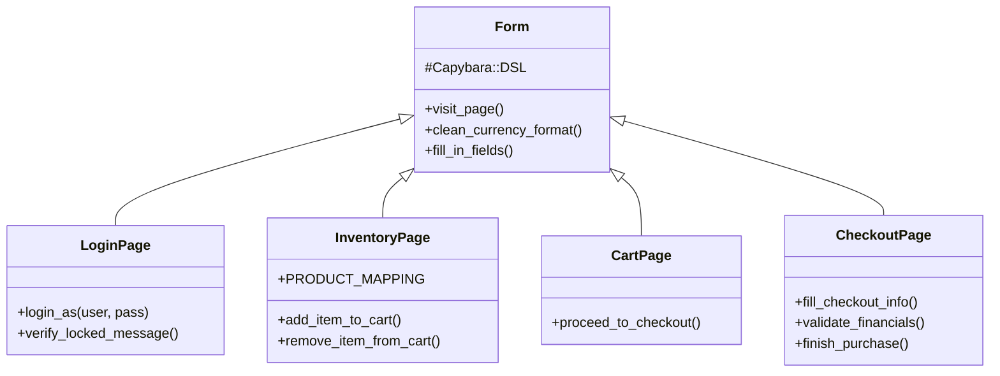

# 🛒 SauceDemo Automation Framework

Este proyecto consiste en una suite de pruebas automatizadas **End-to-End (E2E)** para la plataforma de comercio electrónico [Swag Labs (SauceDemo)](https://www.saucedemo.com).

El framework ha sido desarrollado utilizando **Ruby** y **Cucumber**, implementando estrictamente el patrón de diseño **Page Object Model (POM)** para asegurar la escalabilidad, el mantenimiento y la desacoplación de la lógica de prueba.

## 🛠️ Stack Tecnológico

| Componente | Tecnología | Versión |
| :--- | :--- | :--- |
| **Lenguaje** | Ruby | 3.x |
| **Framework BDD** | Cucumber | Gherkin Syntax |
| **Browser Driver** | Selenium WebDriver | Latest (Manager included) |
| **DSL / Abstracción** | Capybara | Latest |
| **Aserciones** | RSpec | Latest |
| **Navegador** | Google Chrome | V. 143+ |

## 🏗️ Arquitectura del Proyecto (Page Object Model)

La solución se estructura mediante una jerarquía de clases donde `Form` actúa como la clase base que provee las capacidades de Capybara y utilidades comunes a todas las páginas específicas.



### Descripción de Componentes Clave

* **Form.rb (Padre):** Centraliza la configuración de Capybara y métodos reutilizables (ej. limpieza de strings de moneda `$29.99` -> `29.99`).
* **LoginPage:** Encapsula la autenticación y validaciones de seguridad (bloqueos, errores visuales).
* **InventoryPage:** Maneja la lógica compleja del catálogo, mapeo de selectores dinámicos de productos y validación de badges.
* **CheckoutPage:** Gestiona el flujo transaccional y contiene la lógica crítica de validación financiera (Cálculo de impuestos y totales).

## 📋 Cobertura de Pruebas

El alcance del proyecto cubre los flujos críticos del negocio (Smoke & Regression):

1.  **🔐 Autenticación (Módulo A)**
    * Happy Path con usuario estándar.
    * Validación de reglas de negocio para usuarios bloqueados (`locked_out_user`).
    * Verificación de integridad visual (imágenes rotas) para perfiles de error.
2.  **📦 Gestión de Inventario (Módulo B)**
    * Adición y remoción dinámica de productos.
    * Persistencia de estado en botones (Add/Remove).
    * Verificación del contador del carrito en tiempo real.
3.  **💳 Checkout y Finanzas (Módulo C)**
    * Flujo completo de compra (End-to-End).
    * Validación de campos requeridos (Scenario Outline).
    * Validación Matemática: Verificación de que `Subtotal + Tax = Total` coincida con la UI al centavo.

## 🚀 Guía de Instalación y Ejecución

### Prerrequisitos
* Ruby 3.0+ instalado.
* Google Chrome actualizado.
* Internet activo (para descarga de drivers).

### 1. Instalación
Ejecuta el siguiente comando en la raíz del proyecto para instalar las gemas:

```bash
gem install cucumber capybara selenium-webdriver rspec
```
> **Nota:** No es necesario descargar `chromedriver.exe` manualmente. Selenium Manager se encarga de descargar la versión compatible con tu navegador Chrome 143+.

### 2. Ejecución de Pruebas
Para correr toda la suite de pruebas:

```bash
cucumber features/
```

### 3. Ejecución por Etiquetas (Tags)
Puedes filtrar la ejecución según el módulo que desees probar:

```bash
cucumber -t @login    # Solo pruebas de acceso.
cucumber -t @cart     # Solo pruebas de inventario.
cucumber -t @checkout # Solo flujo de compra.
cucumber -t @smoke    # Ejecución rápida de sanidad.
```

### 4. Generación de Reportes
Para obtener un reporte HTML visual:

```bash
cucumber features/ -f html -o reports/reportExecution.html
```

## 📂 Estructura de Carpetas

```text
SauceDemo-Automation/
├── features/
│   ├── login.feature         # Gherkin: Escenarios de Login
│   ├── inventory.feature     # Gherkin: Escenarios de Carrito
│   ├── checkout.feature      # Gherkin: Escenarios de Compra
│   ├── pages/                # Lógica (Page Objects)
│   ├── step_definitions/     # Pasos (Glue Code)
│   └── support/              # Configuración (Env, Hooks)
└── README.md                 # Documentación
```

---
**Autor:** QA Automation Team - Proyecto Final.